# Table of contents
* [User Experience](#user-experience)
  * [User Stories](#user-stories) 
  * [Design](#design)
* [Features](#features)
  * [Existing Features](#existing-features)
  * [Features Left To Implement](#features-left-to-implement)
* [Technologies](#technologies)
* [Testing](#testing)
  * [Validator Testing](#validator-testing)
  * [Manual Testing](#manual-testing)
  * [Bugs](#bugs)
* [Deployment](#deployment)
* [Credits](#credits)

# Project 4 - Code Institute Full Stack Diploma

This is a blog created in Django for completion of 4th project at Code Institute (Full Stack Developer Course).

This blog is a solution offered for a fictional Film Club. This club is conformed of elder population. The idea of this blog is to condense in one simple blog all the information regarding the movie sessions so it is easy to follow.

Please find the link [here](https://djangofilmblog.herokuapp.com/).

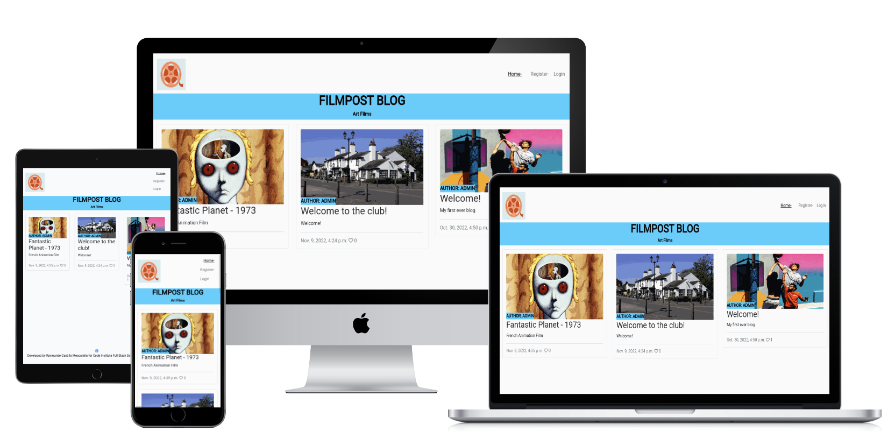
***

# User Stories and Design

### First Time User Goals
First Time User Goals

* As a First Visit User, I understand the objective of the blog.
* As a First Visit User, I understand how to navigate through the website.
* As a First Visit User, I can register an account.
* As a First Visit User, I can read blog's posts.

Registered User Goals

* As a Registered User, I can log in to check the blog.
* As a Registered User, I can post my own comments in the blog.
* As a Registered User, I can modify and edit my posts.
* As a Registered User, I can comment existing blog posts.
* As a Registered User, I can change my password.

Admin User Goals

* As an Admin, I can create, read, update and delete posts from admin panel and directly from website.
* As an Admin, I can approve or disapprove comments.
* As an Admin, I can determine specific level of priviledge of users in order to post blogs.

***
### Design

Color Scheme

These are the colors used #3fcfff, #F8F9FA, 29ABC4, #47B8DB, 040E18.

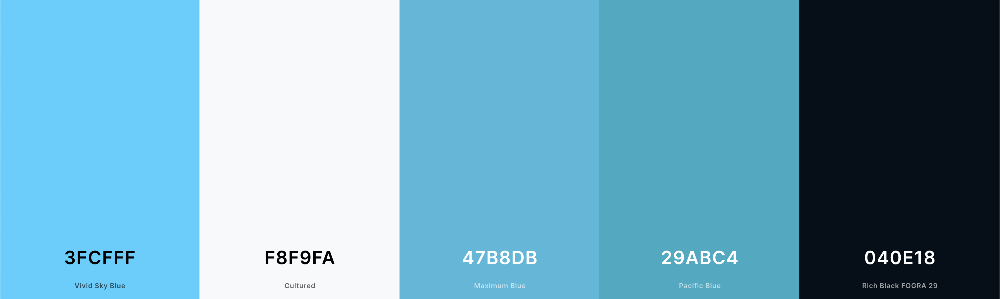

Fonts
Roboto is the font choosed for this project.
***

# Features

<b>Home Page</b>
 
Home Page incorporates base.html page, in which we can find the Nav Bar.
Home Page let's us know if we are logged or if we may need to log in, or Register an account.

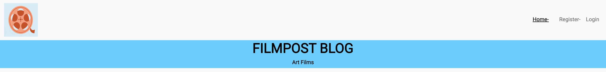

<b>Navigation Bar</b>

We already showed the Nav Bar display with no logged account. 
If the user is logged, we will see the HOME and USERNAME displayed. And the options in order to Edit Profile, Log Out (and Add Post if available) will be listed in a different level.

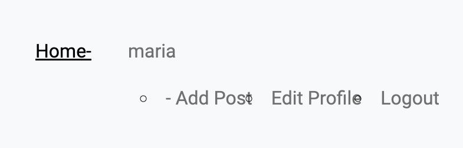

<b>Footer</b>
Code Institute model was reused in order to generate a link to my LinkedIn.

<b>Post View and Post Detail</b>
 
When landing to homepage User will be able to see the list of posts in the blog. These can be clicked and the user will go to the detail view.

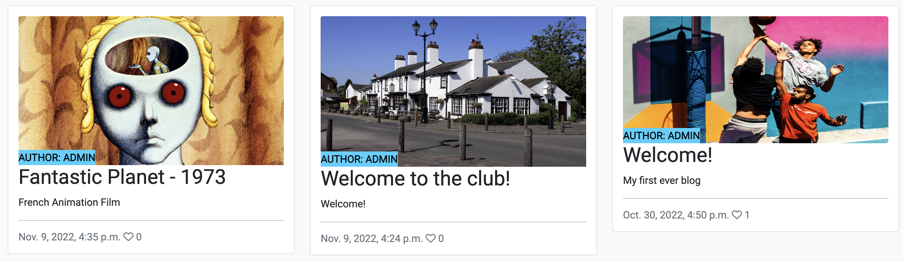
 

<b>Like/Unlike, Post Comments</b>

When logged in after registering you are able to Like/Unlike Posts and to Post Comments.

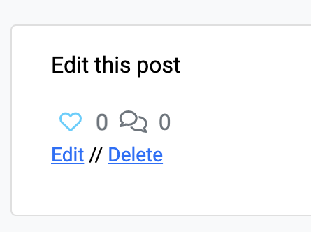

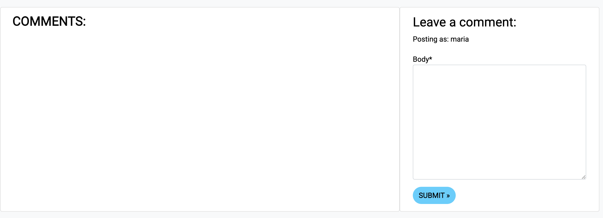
 

<b>Add Post, Edit/Delete Post</b>

After registering, and given the staff access, an user could Add, Edit or Delete Posts.

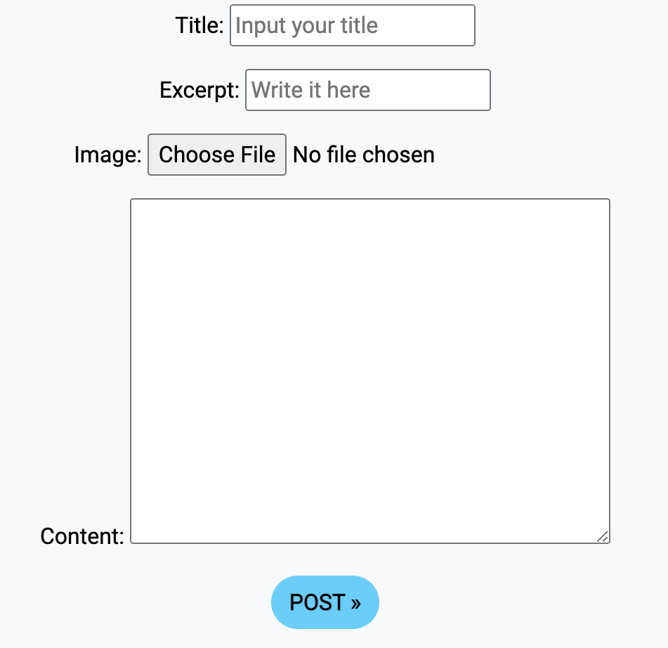

<b>Log In</b>
 
User can log in to account make likes, comments and, if authorized, make posts.

<b>Edit Profile/Password</b>
 
User can edit and update Profile, and from Profile there is a Change Password Option.

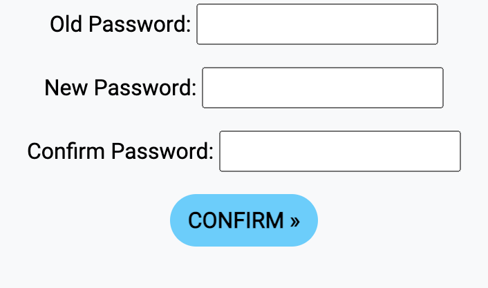

# Technologies

The technologies used for this project are: HTML, CSS, JS, Booststrap, Django, Heroku, Google Fonts.

***

# Testing

### Code Validation

Code validation as follows: 

* HTML Validation

  All HTML code was checked with the [W3C Markup Validation Service](https://validator.w3.org/).

   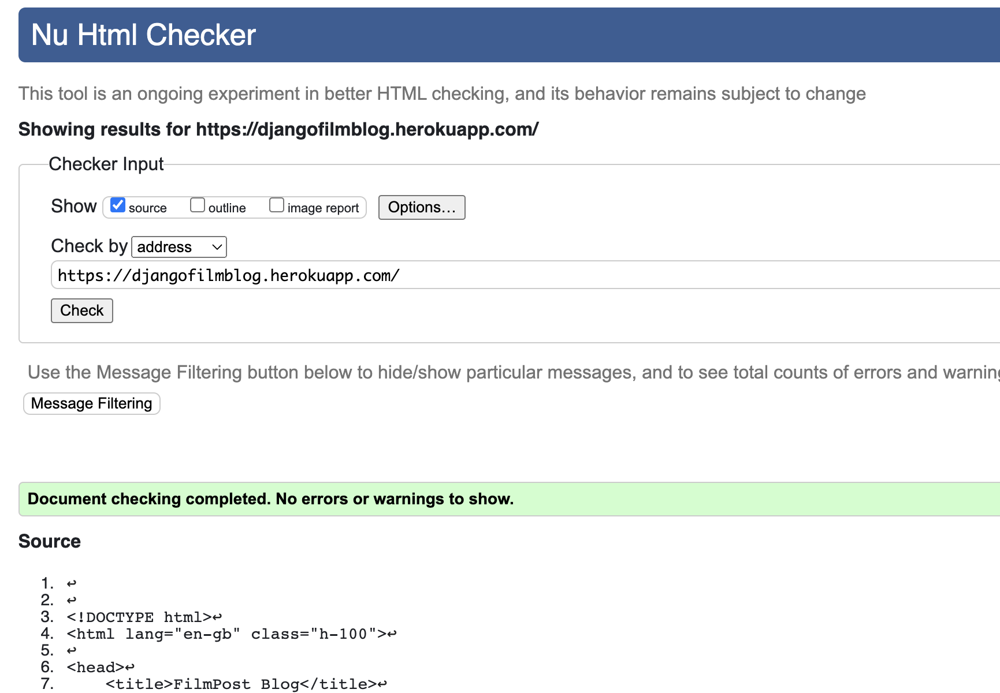

* CSS Validation

  CSS validated through Jigsaw.w3.org/css-validator.

   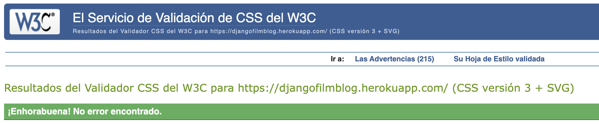

* Python Validation

 Python code was checked with the [PEP8 Online Service](http://pep8online.com/).

admin.py
apps.py
forms.py
models.py
urls.py
views.py

* Accessibility

accessibility tested with the [WAVE Web Accessibility Evaluation Tool](https://wave.webaim.org/).

WAVE report

  

## Testing

  Websit is responsive, tested it on different screen sizes (including cellphones screens).

Google Doc

## Bugs
This project was specially difficult for me. After finishing the Code Institute Module I had a lot of complications in the project, my solutions most times was to repeat the module several times (for which I opened several repositories, as everytime I tried to go further I was unable to find the solution).

I began developing several tutorials from Youtube. Specially based on these 2 channels:

https://www.youtube.com/playlist?list=PLCC34OHNcOtr025c1kHSPrnP18YPB-NFi
https://www.youtube.com/watch?v=OBsLgCm-Ayo&list=PL_KegS2ON4s580mS3nPt5x_eu6kO2cvOc

Finally, after reviewing the project several times (Youtube tutorials, Google Search and Slack community) I was able to perceive that some components have not been correctly installed. 

My first bug was related to not writing down the installed components on setttings.py
I had issues installing the CKEditor as well. The first times after installation it was working well in the Add Post Html, however, after a few pushes, I got errors and I was not able to post (not even from the Admin Page).

As a solution I decided not to declare the content as RichFont, and in step, keep using the normal text editor.

I also found a way to develop a Script which determined the author of the posts from the User Login name.

My process in order to work with this process was more about gathering the pieces of code that worked for me and personalizing it so I can feel confortable and understand the code written here to 100%.

Some aesthethic details were not priorized as I already had a lot of difficulties with CSS (for some reason it took long time to update changes and show them to me when runing server locally). Only when pushed I was able to see the final details.

***

# Deployment
* Code Institute template was use to create project
* Make instalations in Gitpod
* As per tutorial recommendations, project was deployed from first commitment.
* App created in Heroku
* Configurations in Heroku were set up as per tutorial recoomendations
* Click on Deploy in Heroku

***

# Credits
My project was heavily based on Code Institute tutorials. I also learnt different approaches from Youtube and reutilize code from several projects.
https://www.youtube.com/playlist?list=PLCC34OHNcOtr025c1kHSPrnP18YPB-NFi
https://www.youtube.com/watch?v=OBsLgCm-Ayo&list=PL_KegS2ON4s580mS3nPt5x_eu6kO2cvOc